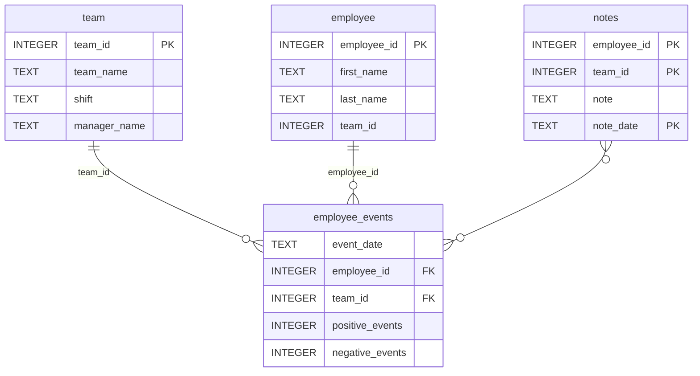

# Employee Performance Dashboard

A data dashboard for monitoring employee and team performance, built as the final project for the **Software Engineering for Data Scientists** Udacity nanodegree.

The dashboard allows managers to:
- Monitor cumulative positive and negative performance events for an individual employee or a team
- View the predicted recruitment risk score generated by a machine learning model
- Read manager notes associated with an employee or team

---

## Getting Started

### 1. Clone the repository

```bash
git clone https://github.com/<your-username>/dsnd-dashboard-project.git
cd dsnd-dashboard-project
```

### 2. Create and activate a virtual environment

```bash
python -m venv venv

# Windows
venv\Scripts\activate

# macOS/Linux
source venv/bin/activate
```

### 3. Install dependencies

```bash
pip install -r requirements.txt
```

### 4. Install the Python package

```bash
pip install ./python-package
```

### 5. Run the dashboard

```bash
cd report
python dashboard.py
```

Then open your browser at `http://localhost:5001`.

---

## Running Tests

```bash
pytest tests/ -v
```

Tests verify that the `employee_events.db` database exists and contains the expected tables. A GitHub Actions workflow runs these tests automatically on every push to `main`.

---

## Repository Structure

```
├── README.md
├── assets
│   ├── model.pkl              # Pre-trained recruitment risk ML model
│   └── report.css             # Dashboard stylesheet
├── python-package
│   ├── employee_events
│   │   ├── __init__.py
│   │   ├── employee.py        # Employee query class
│   │   ├── employee_events.db # SQLite database
│   │   ├── query_base.py      # Shared SQL queries (base class)
│   │   ├── sql_execution.py   # QueryMixin + query decorator
│   │   └── team.py            # Team query class
│   ├── requirements.txt
│   └── setup.py
├── report
│   ├── base_components
│   │   ├── __init__.py
│   │   ├── base_component.py  # BaseComponent parent class
│   │   ├── data_table.py      # HTML table component
│   │   ├── dropdown.py        # Dropdown input component
│   │   ├── matplotlib_viz.py  # Matplotlib chart base class
│   │   └── radio.py           # Radio button component
│   ├── combined_components
│   │   ├── __init__.py
│   │   ├── combined_component.py  # CombinedComponent parent class
│   │   └── form_group.py          # Form wrapper component
│   ├── dashboard.py           # FastHTML app, routes, and dashboard components
│   └── utils.py               # Project paths and model loader
├── requirements.txt
├── tests
│   └── test_employee_events.py
└── .github
    └── workflows
        └── run-tests.yml      # CI workflow
```

---

## Database Schema



---

## Architecture

The project is structured around two layers:

**Python Package (`employee_events`)**
A pip-installable package that provides a clean API for querying the database. Built using a mixin pattern — `QueryMixin` handles all database connection logic, `QueryBase` holds shared SQL queries, and `Employee`/`Team` are subclasses with entity-specific queries.

**Dashboard (`report/`)**
A FastHTML web application built on top of pre-built `BaseComponent` and `CombinedComponent` classes. Custom subclasses in `dashboard.py` extend these to render the line chart, bar chart, data table, and filter form. Routes handle employee and team views separately.

---

## Tech Stack

- [FastHTML](https://fastht.ml/) — web framework
- [pandas](https://pandas.pydata.org/) — data manipulation
- [matplotlib](https://matplotlib.org/) — data visualisation
- [scikit-learn](https://scikit-learn.org/) — ML model
- [pytest](https://pytest.org/) — testing
- SQLite — database